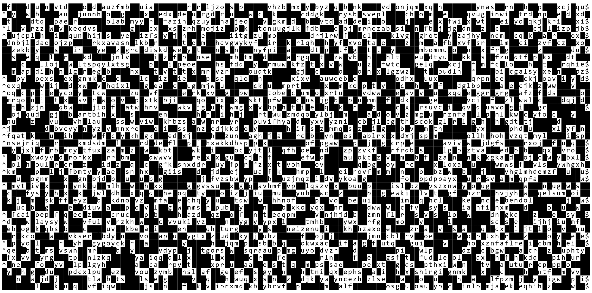

# TextArea

A full screen responsive customizable character grid using HTML 5 Canvas.

# Demo

[Demo](https://strawstack.github.io/TextArea/)

# Screenshot

# Todo

- [ ] Work on Vim
    - [x] Read in a document for testing
    - [ ] Modify mem and visual document on basic typing actions
        - [ ] Implement enter key press (end and middle of line)
        - [x] Implement typed character (end and middle of line)
        - [x] Implement delete key middle and end 
    - [ ] Vim starts in Command mode 
    - [ ] Ability to switch modes: Insert, Visual, and Visual Block
    - [ ] Skip one word back and forward in Command mode
    - [ ] Jump to start and end of line with $ and ^ in Command mode
    - [ ] Switch to edit mode with "i"
    - [ ] Switch to command mode with "escape"
    - [ ] Switch to visual mode and make a selection

- [ ] Bring in filesystem
- [ ] Implement line wrapping when width changes

- [x] Vim installs itself as a bash command
- [x] Memory object is a string array now to help with responsive line wrapping
- [x] Enter submits command
- [x] Bash acts on a command
- [x] Implement vertical scroll
- [x] Implement new line wrapping when typing or editing long commands
- [x] Typing in middle of line shifts characters to the right
- [x] Typing a char and deleting a char correctly modify cmd
- [x] Ability to use up/down arrow to cycle commands
- [x] Prompt
- [x] Up arrow cycles previous commands
- [x] Bound cursor to "used area"

# Bugs

- [ ] Enter key press to break line on lines after the first does not work
- [x] Typing a character at the end of a line prints undefined